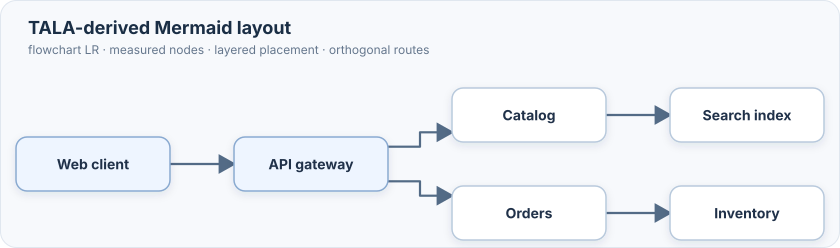
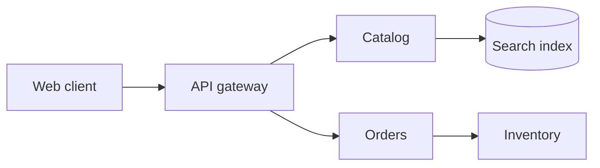

# Mermaid TALA Layout

An experimental TypeScript layout loader for Mermaid 12 flowcharts. It ports
TALA's ordinary graph placement and weighted DAG rank assignment from D2, and
adds nested container layout, deterministic seed attempts, and obstacle-aware
orthogonal routes.



Try the [interactive playground](https://crowecawcaw.github.io/mermaid-layout-tala/) to edit Mermaid flowcharts and compare the TypeScript layout with Mermaid's ELK and Dagre layouts. It includes ten selectable examples, including nested cloud architecture, and controls for direction, layout seeds, spacing, and preview zoom.

The architecture examples use flowchart syntax. Mermaid's `architecture-beta` diagram type has its own renderer and does not use this flowchart layout loader.

## Install

```sh
npm install mermaid mermaid-layout-tala
```

Register the layout loader before rendering diagrams:

```ts
import mermaid from 'mermaid';
import talaLayouts from 'mermaid-layout-tala';

mermaid.registerLayoutLoaders(talaLayouts);
const flowchart = { htmlLabels: false, talaSeeds: [1, 2, 3] };
mermaid.initialize({
  startOnLoad: true,
  layout: 'tala',
  flowchart,
});
```

Then write a normal Mermaid flowchart:



## Scope

The current port supports measured flowchart nodes, nested subgraphs and their
directions, all four root directions (`TB`, `BT`, `LR`, `RL`), connected
components, parallel links, cycles, self loops, deterministic seed selection,
and routes around nodes and unrelated containers. Flat connected components
use translated TALA ordinary placement by default. Set `talaPlacement` to
`'layered'` to use the earlier Mermaid adapter placement; its node and rank
spacing controls are specific to that mode. `talaSeeds` accepts up to 16 distinct safe
integers, with `[1, 2, 3]` as the default. Mermaid's direction declaration
sets direction; it is not a separate TALA option.

This is still a subset of upstream TALA. The upstream engine has many additional
placement and refinement stages for compound graphs, trees, clusters, packing,
edge channels, shape borders, and labels. The ordinary placement stage matches
pinned upstream fixtures; the complete engine does not, so this package should not be treated as layout-equivalent to
the D2 implementation.
See [port status](./PORT_STATUS.md) for the remaining upstream areas.

## Development

```sh
npm ci
npm run build
npm test
```

Run the playground with `npm run demo -- --port 4173`, then open
<http://127.0.0.1:4173/>. Build the GitHub Pages site with
`npm run build:playground`. A push to `main` deploys it through the Pages workflow.
The translated rank tests and their upstream
coverage mapping are in [`test/`](./test/UPSTREAM-RANK-COVERAGE.md).

## Releases

Releases use [Release Please](https://github.com/googleapis/release-please-action)
and Conventional Commits. Commits to `main` update a release PR with the next
version and changelog; merging that PR creates a GitHub release and publishes
the package to npm after the build and tests pass.

- `fix:` creates a patch release.
- `feat:` creates a minor release.
- Add `!` after the type (for example, `feat!:`) for a breaking major release.

## Credits and license

This layout builds on TALA, D2's graph layout engine from Terrastruct. Thanks
to the upstream TALA contributors—Alexander Wang, Gavin Nishizawa, and Júlio
César Batista—for the original work. This is an independent TypeScript port.
The upstream source is pinned to
[D2 commit `bf337903`](https://github.com/d2lang/d2/tree/bf33790338b9854cb2a34418e69c17f9abf8de4b/d2layouts/d2talalayout).

This project is distributed under the Mozilla Public License 2.0. See
[LICENSE](./LICENSE), [NOTICE.md](./NOTICE.md), and
[UPSTREAM-AUTHORS.md](./UPSTREAM-AUTHORS.md) for license and attribution details.
