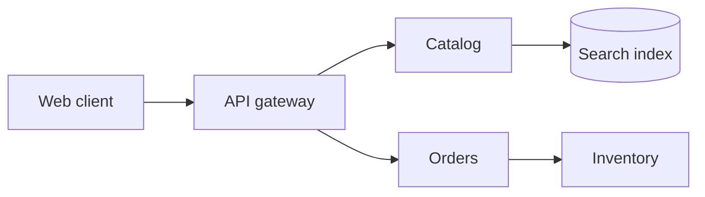

# Mermaid TALA Layout

An experimental TypeScript layout loader for Mermaid 12 flowcharts. It ports
TALA's weighted DAG rank assignment from D2 and adds layer ordering, spacing,
component placement, and orthogonal edge routes.


Try the [interactive playground](https://crowecawcaw.github.io/mermaid-layout-tala/) to edit Mermaid flowcharts and compare TALA with Mermaid's ELK and Dagre layouts. It includes nine selectable examples, including a cloud architecture topology, and controls for TALA's node and layer spacing.

The architecture example uses flowchart syntax because this port does not yet lay out Mermaid's `architecture-beta` diagrams or subgraph containers.

## Install

```sh
npm install mermaid mermaid-layout-tala
```

Register the layout loader before rendering diagrams:

```ts
import mermaid from 'mermaid';
import talaLayouts from 'mermaid-layout-tala';

mermaid.registerLayoutLoaders(talaLayouts);
mermaid.initialize({
  startOnLoad: true,
  layout: 'tala',
  flowchart: { htmlLabels: false },
});
```

Then write a normal Mermaid flowchart:



## Scope

The current port supports measured rectangular flowchart nodes, all four
directions (`TB`, `BT`, `LR`, `RL`), connected components, parallel links,
cycles, and self loops. Subgraph containers are not supported yet. Several
stages from D2's full TALA implementation are also outside this port, including
container placement, label-aware optimization, seed scoring, and obstacle
avoiding edge routing. Treat the layout as experimental while those pieces are
incomplete.

## Development

```sh
npm ci
npm run build
npm test
```

Run the playground with `npm run demo -- --port 4173`, then open
<http://127.0.0.1:4173/>. Build the GitHub Pages site with
`npm run build:playground`. A push to `main` deploys it through the Pages workflow.
The translated rank tests and their upstream
coverage mapping are in [`test/`](./test/UPSTREAM-RANK-COVERAGE.md).

## Releases

Releases use [Release Please](https://github.com/googleapis/release-please-action)
and Conventional Commits. Commits to `main` update a release PR with the next
version and changelog; merging that PR creates a GitHub release and publishes
the package to npm after the build and tests pass.

- `fix:` creates a patch release.
- `feat:` creates a minor release.
- Add `!` after the type (for example, `feat!:`) for a breaking major release.

## Credits and license

This layout builds on TALA, D2's graph layout engine from Terrastruct. Thanks
to the upstream TALA contributors—Alexander Wang, Gavin Nishizawa, and Júlio
César Batista—for the original work. This is an independent TypeScript port.
The upstream source is pinned to
[D2 commit `bf337903`](https://github.com/d2lang/d2/tree/bf33790338b9854cb2a34418e69c17f9abf8de4b/d2layouts/d2talalayout).

This project is distributed under the Mozilla Public License 2.0. See
[LICENSE](./LICENSE), [NOTICE.md](./NOTICE.md), and
[UPSTREAM-AUTHORS.md](./UPSTREAM-AUTHORS.md) for license and attribution details.
