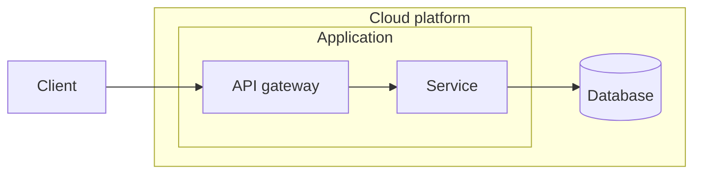

# Mermaid TALA Layout

A Mermaid 12 flowchart layout loader powered by **the original TALA engine**. The adapter measures Mermaid nodes, translates the graph to D2, runs D2's Go TALA implementation through the official `@d2lang/d2` WebAssembly package, then paints the resulting positions and edge routes with Mermaid. The layout algorithm is the upstream code, not a partial TypeScript rewrite.

Try the [interactive playground](https://crowecawcaw.github.io/mermaid-layout-tala/). It includes ten examples, nested architecture diagrams, TALA seed selection, and Mermaid's built-in ELK and Dagre layouts for comparison.

## Install

```sh
npm install mermaid mermaid-layout-tala
```

Register the layout loader before rendering a flowchart:

```ts
import mermaid from 'mermaid';
import talaLayouts, { setTalaSeeds } from 'mermaid-layout-tala';

mermaid.registerLayoutLoaders(talaLayouts);
setTalaSeeds([1, 2, 3]); // optional; these are the upstream defaults
mermaid.initialize({ startOnLoad: true, layout: 'tala' });
```



TALA's original user-facing layout option is the list of deterministic seeds. It runs each seed, scores the results, and chooses the best. The adapter accepts 1–16 signed safe integer seeds through `setTalaSeeds()`, or the `seeds` option on `layoutWithTala()`. Diagram and subgraph directions come from Mermaid's `flowchart` and `direction` syntax. The earlier node and layer spacing sliders were removed because they belonged to this repository's incomplete layout implementation, not upstream TALA.

## Direct layout API

`layoutWithTala(nodes, edges, options)` accepts measured nodes, optional `parentId` and `isGroup` fields, and edges with `from` and `to` IDs. It returns node centers and sizes plus routed edge points. It is asynchronous because the engine runs in a worker. Call `disposeTala()` when a Node process is finished with the engine; browser pages can keep it alive for repeated renders.

```ts
import { layoutWithTala, disposeTala } from 'mermaid-layout-tala';

const result = await layoutWithTala(
  [{ id: 'a', width: 80, height: 40 }, { id: 'b', width: 90, height: 40 }],
  [{ id: 'ab', from: 'a', to: 'b' }],
  { direction: 'LR', seeds: [1, 2, 3] },
);
await disposeTala();
```

## Scope

The upstream TALA stages for hierarchy, nested containers, placement, packing, routing, labels, and seed scoring run intact. Mermaid's layout loader supplies flowchart geometry and styling; it does not expose every feature of D2's language, such as `near` and SQL table rows. Mermaid `architecture-beta` diagrams use Mermaid's own renderer, so choose a flowchart with subgraphs when comparing architecture layouts in the playground. Shapes without a close D2 counterpart are treated as rectangles for TALA's routing calculation while Mermaid still paints their original shape.

The official D2 WebAssembly package is a large download. The playground loads it when TALA is first used, then reuses the worker for later renders.

## Development

```sh
npm ci
npm run build
npm run check:playground
npm run build:playground
npm test
```

Run the playground with `npm run demo -- --port 4173`, then open <http://127.0.0.1:4173/>. A push to `main` deploys GitHub Pages through the Pages workflow.

## Releases

Releases use [Release Please](https://github.com/googleapis/release-please-action) and Conventional Commits. Commits to `main` update a release PR; merging that PR creates a GitHub release and publishes to npm after CI passes. This change removes the old synchronous partial-layout API and requires a major version bump for publication.

## Credits and license

TALA and D2 are copyright Terrastruct Inc. and contributors, and distributed under the Mozilla Public License 2.0. This package depends on [`@d2lang/d2` 0.1.34](https://www.npmjs.com/package/@d2lang/d2/v/0.1.34), which contains the upstream Go TALA engine compiled to WebAssembly. Thanks to Alexander Wang, Gavin Nishizawa, and Júlio César Batista for their work on TALA.

This adapter is distributed under the Mozilla Public License 2.0. See [LICENSE](./LICENSE), [NOTICE.md](./NOTICE.md), and [UPSTREAM-AUTHORS.md](./UPSTREAM-AUTHORS.md).
