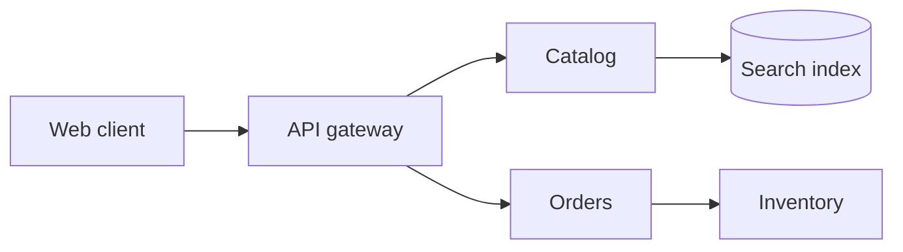

# Mermaid TALA Layout

An experimental TypeScript layout loader for Mermaid 12 flowcharts. It ports
TALA's weighted DAG rank assignment from D2 and adds layer ordering, spacing,
component placement, and orthogonal edge routes.


## Install

```sh
npm install mermaid mermaid-layout-tala
```

Register the layout loader before rendering diagrams:

```ts
import mermaid from 'mermaid';
import talaLayouts from 'mermaid-layout-tala';

mermaid.registerLayoutLoaders(talaLayouts);
mermaid.initialize({
  startOnLoad: true,
  layout: 'tala',
  flowchart: { htmlLabels: false },
});
```

Then write a normal Mermaid flowchart:



## Scope

The current port supports measured rectangular flowchart nodes, all four
directions (`TB`, `BT`, `LR`, `RL`), connected components, parallel links,
cycles, and self loops. Subgraph containers are not supported yet. Several
stages from D2's full TALA implementation are also outside this port, including
container placement, label-aware optimization, seed scoring, and obstacle
avoiding edge routing. Treat the layout as experimental while those pieces are
incomplete.

## Development

```sh
npm ci
npm run build
npm test
```

Run the interactive examples with `npm run demo -- --port 4173`, then open
<http://127.0.0.1:4173/examples/>. The translated rank tests and their upstream
coverage mapping are in [`test/`](./test/UPSTREAM-RANK-COVERAGE.md).

## License and attribution

This project is distributed under the Mozilla Public License 2.0. It contains
a TypeScript port of the TALA DAG ranker from D2. See [LICENSE](./LICENSE),
[NOTICE.md](./NOTICE.md), and [UPSTREAM-AUTHORS.md](./UPSTREAM-AUTHORS.md).
The upstream source is pinned to
[D2 commit `bf337903`](https://github.com/d2lang/d2/tree/bf33790338b9854cb2a34418e69c17f9abf8de4b/d2layouts/d2talalayout).
